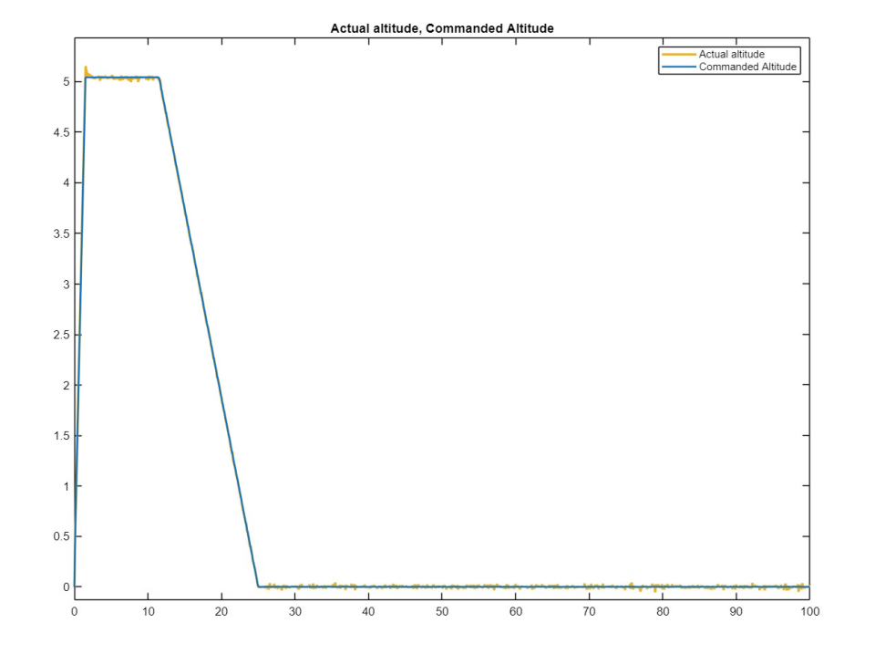

# VTOL-Altitude-PID-Control
PID altitude controller for a Vertical Take-Off and Landing (VTOL) UAV developed in Simulink, featuring signal filtering and noise robustness testing.

Project Overview: This project features a high-fidelity 1-Degree of Freedom (1D) simulation of a VTOL UAV's altitude control system. The model implements a PID controller to track dynamic flight profiles while accounting for real-world constraints like sensor noise and actuator saturation.

<i>Figure 1: Closed-loop response showing Actual Altitude (yellow) tracking Commanded Altitude (blue).</i>

Technical Architecture: The system is built with a closed-loop feedback architecture:

Plant Model: A double-integrator transfer function ($1/ms^2$) representing the drone's vertical physics.

Controller: A tuned PID controller designed to minimize steady-state error and settling time.Signal 

Processing: A first-order low-pass filter ($\frac{1}{\tau s + 1}$) implemented to attenuate high-frequency noise introduced into the feedback loop.

Mission Profile: Dynamic setpoints generated via the Simulink Signal Editor to simulate take-off, hover, and landing sequences.

Engineering Analysis: 

Control Tuning & Performance: The controller was tuned to achieve precise tracking with the following parameters:

Proportional (P): 200 — Provides rapid response to altitude errors.

Integral (I): 50 — Eliminates steady-state error during hover.

Derivative (D): 75 — Provides damping to reduce overshoot.

Robustness Testing: To simulate real-world conditions, Band-Limited White Noise was injected into the sensor feedback. High derivative gains ($D=75$) amplified sensor noise, causing significant signal jitter.

The Solution: A low-pass filter with a time constant of $\tau = 0.01s$ was implemented. This value was optimized to provide maximum noise attenuation without introducing excessive phase lag that would destabilize the system.

How to Run: Open initialize_drone.m in MATLAB to load the vehicle mass ($m$) and PID gains into the workspace. Open drone_sim.slx in Simulink.Ensure flight_mission.mat is in the same directory. Press Run.Results & DocumentationView Full Results Report (PDF)Settling Time: ~12 seconds.Steady-State Error: $<1\%$.

